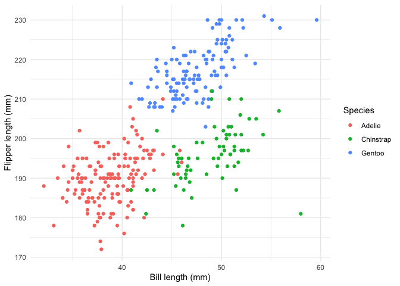

Homework 1
================
Harrison Wei

## Problem 1

``` r
data("penguins", package = "palmerpenguins")
```

The `penguins` data have one row per penguin, with 344 rows and 8
columns. The `species` values are Adelie, Chinstrap, Gentoo, and the
`island` values are Biscoe, Dream, Torgersen. Measurements include
`bill_length_mm`, `flipper_length_mm`, and `body_mass_g`; the data also
record `sex` and `year` (2007–2009). The mean flipper length is 200.9
mm; this calculation excludes 2 missing values.

``` r
library(ggplot2)

penguin_plot <- ggplot(
  penguins,
  aes(x = bill_length_mm, y = flipper_length_mm, color = species)
) +
  geom_point(na.rm = TRUE) +
  labs(
    x = "Bill length (mm)",
    y = "Flipper length (mm)",
    color = "Species"
  ) +
  theme_minimal()

penguin_plot
```

<!-- -->

``` r
ggsave(
  filename = "penguins_scatterplot.png",
  plot = penguin_plot,
  width = 7,
  height = 5,
  dpi = 300
)
```

The points suggest that Gentoo penguins tend to have longer flippers
than the other two species. The scatterplot is also saved as
`penguins_scatterplot.png` in the project directory.

## Problem 2

``` r
set.seed(8105)

normal_sample <- rnorm(10)
sample_data <- data.frame(
  normal_sample = normal_sample,
  above_zero = normal_sample > 0,
  character_value = letters[1:10],
  factor_group = factor(rep(c("A", "B", "C"), length.out = 10))
)

sample_data
```

    ##    normal_sample above_zero character_value factor_group
    ## 1     0.67419607       TRUE               a            A
    ## 2     1.30852071       TRUE               b            B
    ## 3     0.11518101       TRUE               c            C
    ## 4     1.07114872       TRUE               d            A
    ## 5     0.15497656       TRUE               e            B
    ## 6     2.11815800       TRUE               f            C
    ## 7    -0.21923983      FALSE               g            A
    ## 8    -0.11331360      FALSE               h            B
    ## 9    -0.06511751      FALSE               i            C
    ## 10    0.47567386       TRUE               j            A

I took the mean of each column separately:

``` r
mean(sample_data$normal_sample)
```

    ## [1] 0.5520184

``` r
mean(sample_data$above_zero)
```

    ## [1] 0.7

``` r
mean(sample_data$character_value)
```

    ## [1] NA

``` r
mean(sample_data$factor_group)
```

    ## [1] NA

The numeric sample has a mean of 0.55. The logical mean is 0.7, which is
the proportion of sampled values above zero because R treats `TRUE` as 1
and `FALSE` as 0 in this calculation. The character and factor columns
return `NA` with warnings: their values are not numeric measurements
that `mean()` can average directly.

The following conversions are evaluated, but their output is hidden:

``` r
as.numeric(sample_data$above_zero)
as.numeric(sample_data$character_value)
as.numeric(sample_data$factor_group)
```

Converting the logical values gives 0s and 1s, which explains why their
mean works. The letters cannot be converted to numbers, so
`as.numeric()` gives `NA`. A factor converts to the integer codes for
its levels (1, 2, and 3 here). Those codes are labels, not meaningful
measurements, so averaging them would be misleading even though they are
numeric after conversion.
